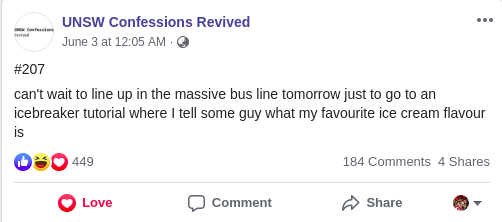

# Week 1 Tutorial

### Welcome to COMP1521!

Today we will be covering:

* Introductions

* Admin stuff
* C revision
* Some more complex C behaviours

---

## Today we will closely follow the questions on the [course page](https://cgi.cse.unsw.edu.au/~cs1521/21T3/tut/01/questions)
