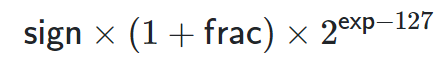

# Week 3 Tutorial Notes

Today we will be covering:

- Two's Complement
- Unions
- Floating Point Numbers (IEEE 754)

Questions from last week:
- On vs. Off
- LSB vs. MSB
- What format is stuff actually stored as on the computer?

---

## Q1 - What is One's Complement? Why do we not use it?

<details>

One's Complement is a method for converting the binary representation of a positive integer to its negative counterpart. It is simply achieved by flipping (or `not`ing) the bits of the positive number. For example:

`-1 = ~0001 = 1110`

It leads to a table as such:

Decimal | Positive | Negative
--------|----------|--------
0 | 0000 | 1111
1 | 0001 | 1110
2 | 0010 | 1101
3 | 0011 | 1100
4 | 0100 | 1011
5 | 0101 | 1010
6 | 0110 | 1001
7 | 0111 | 1000

<summary>Answer</summary>

</details>

<br>

---

## Q2 - What is Two's Complement?

<details>

It is the same as One's Complement but we add one at the end.

`-1 = ~0001 + 1 = 1110 + 1 = 1111`

This is useful as consider if we have zero

`0 = 0000`

`-0 = ~0000 + 1 = 1111 + 1 = 0000`

It leads to a table as such:

Decimal | Positive | Negative
--------|----------|--------
0 | 0000 | 0000
1 | 0001 | 1111
2 | 0010 | 1110
3 | 0011 | 1101
4 | 0100 | 1100
5 | 0101 | 1011
6 | 0110 | 1010
7 | 0111 | 1001

<summary>Answer</summary>

</details>

<br>

---

## Q3 - Convert the following 16-bit hex into two's complement integers.

<details>


Decimal  | Binary   | Octal   | Hex 
---------|----------|-------- | ------
0        | 0000     | 00      | 0 
1        | 0001     | 01      | 1
2        | 0010     | 02      | 2
3        | 0011     | 03      | 3
4        | 0100     | 04      | 4 
5        | 0101     | 05      | 5
6        | 0110     | 06      | 6
7        | 0111     | 07      | 7
8        | 1000     | 10      | 8 
9        | 1001     | 11      | 9
10       | 1010     | 12      | A
11       | 1011     | 13      | B
12       | 1100     | 14      | C 
13       | 1101     | 15      | D
14       | 1110     | 16      | E
15       | 1111     | 17      | F

<summary>Hex to Binary Table</summary>

</details>

<br>

### 0x0013

<details>

`0 => 0000, 1 => 0001 => 3 => 0011`

`=> 0000 0000 0001 00011`

First bit is off => Positive

`= + (1*16 + 3*1) = + 19`

<summary>Answer</summary>

</details>

<br>

### 0x0444

<details>

`0 => 0000, 4 => 0100`

`=> 0000 0100 0100 0100`

First bit is off => Positive

`= + (4*256 + 4*16 + 4*1) = 1092`

<summary>Answer</summary>

</details>

<br>

### 0x1234

<details>

`1 => 0001, 1 => 0010 => 3 => 0011, 4=> 0100`

`=> 0000 0000 0001 00011`

First bit is off => Positive

`= + (1*4096 + 2*256 + 3*16 + 4*1) = 4660`

<summary>Answer</summary>

</details>

<br>

### 0xFFFF

<details>

`F => 1111`

`0xFFFF => 1111 1111 1111 1111`

First bit is on => Negative

`= - (~FFFF + 1) = - (0000 + 1) = - (0000 0000 0000 0001) =  -1`

<summary>Answer</summary>

</details>

<br>

### 0x8000

<details>

`8 => 1000`

`0x8000 => 1000 0000 0000 0000`

First bit is on => Negative

`= - (~8000 + 1) = - (0111 1111 1111 1111 + 1) = - (1000 0000 0000 0000) = - 8*4096 = -32768`

<summary>Answer</summary>

</details>

<br>

---

## Convert the following into hexadecimal 16-bit two's complement integers

<details>

Decimal  | Binary   | Octal   | Hex 
---------|----------|-------- | ------
0        | 0000     | 00      | 0 
1        | 0001     | 01      | 1
2        | 0010     | 02      | 2
3        | 0011     | 03      | 3
4        | 0100     | 04      | 4 
5        | 0101     | 05      | 5
6        | 0110     | 06      | 6
7        | 0111     | 07      | 7
8        | 1000     | 10      | 8 
9        | 1001     | 11      | 9
10       | 1010     | 12      | A
11       | 1011     | 13      | B
12       | 1100     | 14      | C 
13       | 1101     | 15      | D
14       | 1110     | 16      | E
15       | 1111     | 17      | F

<summary>Hex to Binary Table</summary>

</details>

<br>

### 1

<details>

`1 = 0000 0000 0000 0001 = 0x0001`

<summary>Answer</summary>

</details>

<br>

### 100

<details>

`100 = 0000 0000 0110 0100 = 0x0064`

<summary>Answer</summary>

</details>

<br>

### 1000

<details>

`1000 = 0000 0011 1110 1000 = 0x03E8`

<summary>Answer</summary>

</details>

<br>

### 10000

<details>

`1 = 0010 0111 0001 0000 = 0x2710`

<summary>Answer</summary>

</details>

<br>

### -5

<details>

`5 = 0000 0000 0000 0101`

`~5 = 1111 1111 1111 1010`

`~5 + 1 = 1111 1111 1111 1011 = 0xFFFB`

<summary>Answer</summary>

</details>

<br>

### -100

<details>

`100 = 0000 0000 0110 0100`

`~100 = 1111 1111 1001 1011`

`~100 + 1 = 1111 1111 1001 1100 = 0xFF9C`

<summary>Answer</summary>

</details>

<br>

---

## On a machine with 16-bit ints, the C expression (30000 + 30000) yields a negative result.

Why the negative result? How can you make it produce the correct result?

<details>

Since the two numbers in the expression are treated as int values, the overall expression is computed as an int value. In C, an int is a signed value, which means that one of the sixteen bits is effectively used as a sign (+ or -) bit, leaving only fifteen bits to represent the magnitude. The negative result occurs because 60000 cannot be stored in fifteen bits. The maximum value is `0x7FFF = 2^15 − 1 = 32767`
.

<summary>Answer</details>

</details>

<br>

---

## What is a IEEE 754-encoded bit string?

<details>





<summary>Answer</summary>

</details>

<br>

---

## Convert the following IEEE 754-encoded bit strings to their decimal counterparts.

<br>

### 0 00000000 00000000000000000000000

<details>

`sign = 0 => positive`

`exponent = 0`

`fraction = 0`

`1 * (1 + 0) * 2 ^ (0 - 127) = 1 * 2^(-127)`

`approx = 0`

<summary>Answer</summary>

</details>

<br>

### 1 00000000 00000000000000000000000

<details>

`sign = 1 => negative`

`exponent = 0`

`fraction = 0`

`-1 * (1 + 0) * 2 ^ (0 - 127) = - 1 * 2^(-127)`

`approx = -0`

<summary>Answer</summary>

</details>

<br>

### 0 01111111 10000000000000000000000

<details>

`sign = 0 => positive`

`exponent = 0111 1111 = 0x7F = 7*16 + 15*1 = 127`

`fraction = 1*1/2 = 0.5`

`1 * (1 + 0.5) * 2 ^ (127 - 127) = 1 * 1.5 * 1 = 1.5`

`exactly = 1.5`

<summary>Answer</summary>

</details>

<br>

### 0 01111110 00000000000000000000000

<details>

`sign = 0 => positive`

`exponent = 0111 1110 = 0x7E = 7*16 + 14*1 = 126`

`fraction = 0`

`1 * (1 + 0) * 2 ^ (126 - 127) = 0.5`

`exactly = 0.5`

<summary>Answer</summary>

</details>

<br>

### 0 01111110 11111111111111111111111

<details>

`sign = 0 => positive`

`exponent = 0111 1110 = 0x7E = 7*16 + 14*1 = 126`

`fraction = 1/2 + 1/4 + 1/8 + ... + 1/8388608 == 0.9999`

`1 * (1 + 0.9999) * 2 ^ (126 - 127) = 1.9999 * 1/2 = 0.9999`

`approx = 1`

<summary>Answer</summary>

</details>

<br>

### 0 10000000 01100000000000000000000

<details>

`sign = 0 => positive`

`exponent = 1000 0000 = 0x80 = 16*8 = 128`

`fraction = 1/4 + 1/8 = 0.375`

`1 * (1 + 0.375) * 2 ^ (128 - 127) = 1.375 * 2 = 2.75`

`exact = 2.75`

<summary>Answer</summary>

</details>

<br>

### 0 10010100 10000000000000000000000

<details>

`sign = 0 => positive`

`exponent = 1001 0100 = 0x94 = 16*9 + 1*4 = 148`

`fraction = 1/2 = 0.5`

`1 * (1 + 0.5) * 2 ^ (148 - 127) = 1.5 * 2^21 = 3145728`

`exact = 3145728`

<summary>Answer</summary>

</details>

<br>

---

## Convert the following decimal numbers into IEEE 754-encoded bit-strings:

<details>


<summary>Note</summary>

</details>

<br>

### 2.5

<details>

`Divide by 2 once to get 1.25 => 1.25 * 2^1`

`= (1 + 0.25) * 2^1`

`frac = 0.25 = 1/4 = 01000 ...`

`sign = positive = 0`

`2^1 => 2 ^ (128 - 127) = 1000 0000`

`0 10000000 01000000000000000000000`

<summary>Answer</summary>

</details>

<br>

### 0.375

<details>

`Multiply by 2 twice to get 1.5 => 1.5 * 2^-2`

`= (1 + 0.5) * 2^2`

`frac = 0.5 = 1/2 = 1000 ...`

`sign = positive = 0`

`2^2 => 2 ^ (125 - 127) = 0111 1101`

`0 01111101 10000000000000000000000`

<summary>Answer</summary>

</details>

<br>

### 27

<details>

`Divide by 2 four times to get 1.6875 => 1.6875 * 2^4`

`= (1 + 0.6875) * 2^4`

`frac = 0.6875 = 0.5 + 0.125 + 0.0675 = 1000 ...`

`sign = positive = 0`

`2^2 => 2 ^ (125 - 127) = 0111 1101`

`0 01111101 10000000000000000000000`

<summary>Answer</summary>

</details>

<br>

---

## Q6 - Write a C function, six_middle_bits, which, given a uint32_t, extracts and returns the middle six bits.

<details>

```c

    uint32_t six_middle_bits(uint32_t u) {
        return (u >> 13) & 0x3F;
    }

```

<summary>Answer</summary>

</details>

<br>

---

## Q7 - Draw diagrams to show the difference between the following two data structures:

```c

    struct {
        int a;
        float b;
    } x1;

    union {
        int a;
        float b;
    } x2;

```

If x1 was located at &x1 == 0x1000 and x2 was located at &x2 == 0x2000, what would be the values of &x1.a,   &x1.b,   &x2.a, and   &x2.b?

## Q8 - How large (#bytes) is each of the following C unions?

Assume: `sizeof(char) == 1`,   `sizeof(short) == 2`,   `sizeof(int) == 4`.

<br>

### `union { int a; int b; } u1;`

<details>

4

<summary>Answer</summary>

</details>

<br>

### `union { unsigned short a; char b; } u2;`

<details>

2

<summary>Answer</summary>

</details>

<br>

### `union { int a; char b[12]; } u3;`

<details>

12

<summary>Answer</summary>

</details>

<br>

### `union { int a; char b[14]; } u4;`

<details>

16 (with padding)

<summary>Answer</summary>

</details>

<br>

### `union { unsigned int a; int b; struct { int x; int y; } c; } u5;`

<details>

8

<summary>Answer</summary>

</details>

<br> 